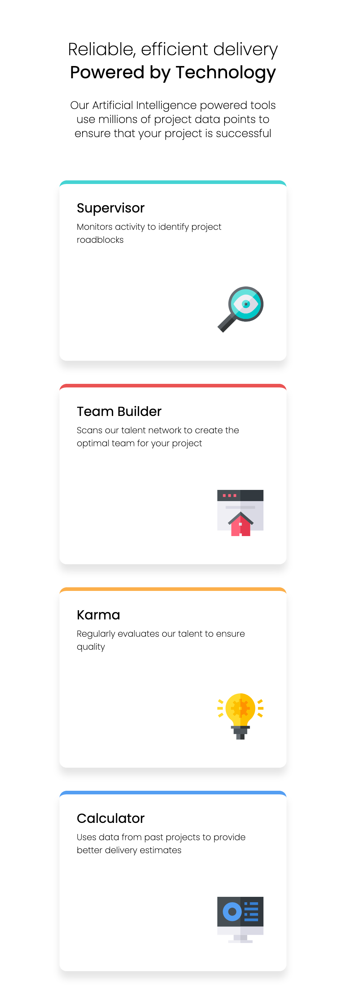
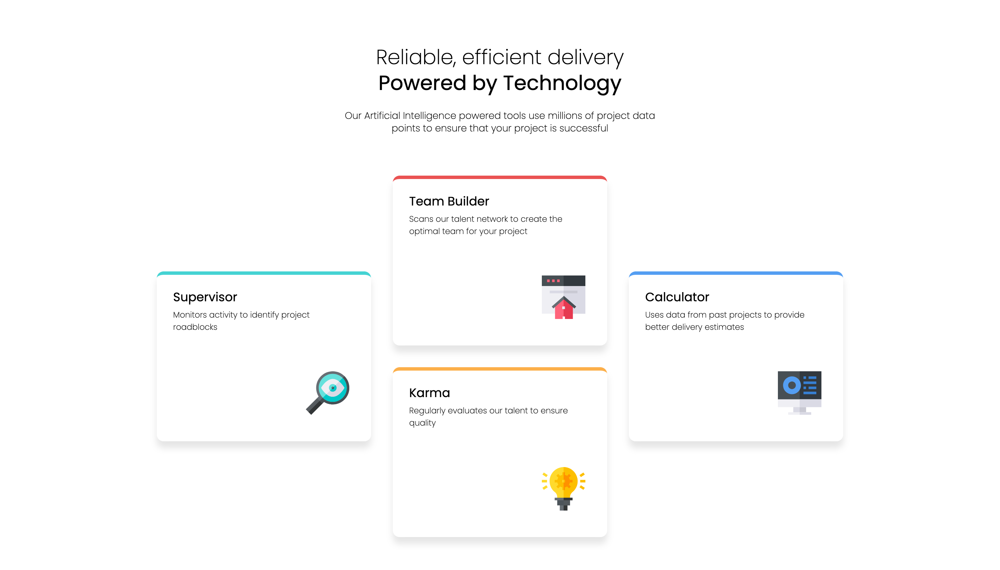

# Frontend Mentor - Four card feature section solution

This is a solution to the [Four card feature section challenge on Frontend Mentor](https://www.frontendmentor.io/challenges/four-card-feature-section-weK1eFYK). Frontend Mentor challenges help you improve your coding skills by building realistic projects.

## Table of contents

- [Overview](#overview)
  - [The challenge](#the-challenge)
  - [Screenshot](#screenshot)
  - [Links](#links)
- [My process](#my-process)
  - [Built with](#built-with)
  - [What I learned](#what-i-learned)
  - [Continued development](#continued-development)
  - [Useful resources](#useful-resources)
  - [AI Collaboration](#ai-collaboration)
- [Author](#author)
- [Acknowledgments](#acknowledgments)

## Overview

This project is a solution to the Frontend Mentor Four card feature section challenge. The goal was to build a responsive Four card feature section that matched the designs provided.

### The challenge

Users should be able to:

- View the optimal layout for the site depending on their device's screen size

### Screenshot

### Links

- Github URL: https://github.com/arielvonlestat/Four-Card-Feature-Section

- Live Site URL: https://arielvonlestat.github.io/Four-Card-Feature-Section/

## My process

This is the first README.md file that I have done when I did the actual challenge, as I did not realize how to do so prior and therefore did them as I updated the HTML & CSS code.

I started with the HTML document. Linking my CSS & Reset documents. I took all of the main cards (Supervisor, Team Builder, Karma, & Calculator) and wrapped them in a "main" element. I then took each card and made a "div" with a class showing each card seperately. Within those classes I took all the respective headers and made them "h3"s and took all the text and made them into "p"s.

I then encased all of the top information into a header and split the text between an "h1" "h2" & a "p". This enabled me to work on everything seperately within CSS.

As far as the CSS goes, as always I started with the Mobile version of the page. I began as I always do using a :root color system to track colors & this time I decided to do the font directly in CSS which I had never done before. Set up the overal "body" & then began working on the cards themselves.

These I tried to group all of them together within CSS using flexbox to give them their layout, changing their boarder-radius, widths & heights, and even giving them their box-shadow. I then individually gave them their colorful border tops.

I then focused on their contents. Making sure that the headers, the paragraph text, & the images were where they needed to be.

Lastly I did the desktop version which of course used CSS Grid. I had never used it before so I did some research, spoke to ChatGPT, & then practiced and fooled around with it until I got it where I wanted to. This was all done with Media Queries. I then adjusted things that needed to be adjusted here like the header text, also using Media Queries.

### Built with

- Semantic HTML5 markup
- CSS custom properties
- Flexbox
- CSS Grid
- VS Code

### What I learned

My biggest take away from this challege was CSS Grid. I had never actually used it before. So as stated above, I did some research as well as talking through it with ChatGPT to get an overall basis for what the concept was. I then puilled it up on Chrome DevTools and pulled up the grid itself so I could visually see this! I didn't know I could do this prior to researching so this was extremely helpful. I learned that within the grid it focuses on the lines as well as how many rows and although it is still pretty confusing to me, I was proud that I was able to figure it out and can't wait to continue learning.

### Continued development

As I've stated in other README.md files, I think at this point I am ready to move on to learning javascript. I am by no means an expert at CSS but I feel a lot more confident in my skills now.

I will continue to work on CSS Grid & continue to do Frontend Mentor challenges. Once I get to a Javascript challenge then I'll start learning Javascirpt via my Udemy Bootcamp.

### Useful resources

- [Google Chrome](https://www.google.com/chrome/) - I know it sounds a little silly to add this as a useful resource as everyone probably already knows what it is. However, when it came to being able to see the Grid visually within Chrome's DevTools, this was an absoute game changer for me learning CSS Grid. I am a visual learner & I admittedly don't use the Dev tools as much as I probably should but again I cannot stress enough how valueable this was!

### AI Collaboration

- What tools did you use (e.g., ChatGPT, Claude, GitHub Copilot)?

As mentioned above I used ChatGPT.

- How did you use them (e.g., debugging, generating boilerplate, brainstorming solutions)?

I am always very careful in the way that I use it. I do not want it doing the work for me and therefore I only ask it specific questions to understand better. Typically overall concepts, or generalized ideas. I am careful not to ask it to just completely do something for me as I do not feel like I learn that way. If it does give me more information than I want (which it has from time to time) then I spend a lot of time understanding why the answer or concept works and if it doesn't explain it in a way I can understand I asked questions to make sure I understand it.

- What worked well? What didn't?

The overall concept of Grid CSS it helped with a lot. I don't know why but it was often wrong this time. I kept catching it telling me soemthing that I knew wasn't true and I would correct it and it would tell me something else that wasn't true. Very frustrating & outside of the concept of CSS Grid (which I could have gotten elsewhere) it was more of a burden than a help.

## Author

- Frontend Mentor - [ArielVonLestat](https://www.frontendmentor.io/profile/arielvonlestat)
